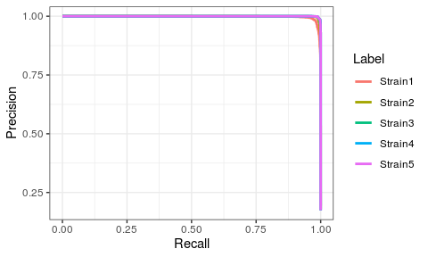

Decompose strain genomes from pangenome mapping data
================

## Load package

``` r
library(strainpandar)
```

## A demo dataset

Each row is one gene and each column is one sample:

``` r
data(fprausnitzii)
```

## Preprocessing

``` r
demo.preprocessed <- preprocess(fprausnitzii$data, pangenome.file = fprausnitzii$pangenome)
```

    ## 

## Run main program

``` r
res <- strain.decompose(demo.preprocessed, ncpu = 8, rank=5)
```

    ## Loading required package: pkgmaker

    ## Loading required package: registry

    ## Loading required package: rngtools

    ## Loading required package: cluster

    ## NMF - BioConductor layer [OK] | Shared memory capabilities [NO: bigmemory] | Cores 175/176

    ##   To enable shared memory capabilities, try: install.extras('
    ## NMF
    ## ')

    ## Setting the maximum number of strains to 10 (number of samples)...

Visulaize the strain profile

``` r
## match predicted with the ground truth
ans <- fprausnitzii$ans[rank(apply(fprausnitzii$ans[,c(1,7,8,9,10)], 2, which.max)),]
ans$strain <- rownames(ans)
pred <- data.frame(res$S[rank(apply(res$S[,c(1,7,8,9,10)], 2, which.max)),])
pred$strain <- rownames(ans)

library(ggplot2)
library(dplyr)
```

    ## 
    ## Attaching package: 'dplyr'

    ## The following object is masked from 'package:Biobase':
    ## 
    ##     combine

    ## The following objects are masked from 'package:BiocGenerics':
    ## 
    ##     combine, intersect, setdiff, union

    ## The following objects are masked from 'package:stats':
    ## 
    ##     filter, lag

    ## The following objects are masked from 'package:base':
    ## 
    ##     intersect, setdiff, setequal, union

``` r
library(reshape2)

rbind(data.frame(melt(ans), v="Ground truth"), 
      data.frame(melt(pred), v="StrainPanDA prediction")) %>% 
  ggplot(aes(x=variable, y=value, fill=strain)) + 
  geom_bar(stat="identity") +
  facet_wrap(~v) + 
  theme_bw() + 
  labs(x=NULL, y="relative abundances") + 
  theme(axis.text.x = element_text(angle=45, vjust=1,hjust=1))
```

    ## Using strain as id variables

    ## Using strain as id variables

<!-- -->

``` r
library(PRROC)
scores <- res$P_est[,rownames(pred)]
truth <- demo.preprocessed$reference[, rownames(ans)]
truth <- truth[rowSums(truth)!=0,]
merged <- merge(scores, truth, by=0, all=TRUE)
merged[is.na(merged)] <- 0


s1 <- pr.curve(weights.class0 = merged[,7], scores.class0 = merged[,2], curve = TRUE) 
s2 <- pr.curve(weights.class0 = merged[,8], scores.class0 = merged[,3], curve = TRUE) 
s3 <- pr.curve(weights.class0 = merged[,9], scores.class0 = merged[,4], curve = TRUE) 
s4 <- pr.curve(weights.class0 = merged[,10], scores.class0 = merged[,5], curve = TRUE) 
s5 <- pr.curve(weights.class0 = merged[,11], scores.class0 = merged[,6], curve = TRUE) 

rbind(
  data.frame(s1$curve, Label='Strain1'),
  data.frame(s2$curve, Label='Strain2'),
  data.frame(s3$curve, Label='Strain3'),
  data.frame(s3$curve, Label='Strain4'),
  data.frame(s3$curve, Label='Strain5')
) %>% 
  dplyr::select(Recall=X1, Precision=X2, Label) %>% 
  ggplot(aes(x=Recall, y=Precision, col=Label))+
  geom_path(lwd=1) + 
  theme_bw()
```

<!-- -->

Session information

``` r
sessionInfo()
```

    ## R version 3.6.3 (2020-02-29)
    ## Platform: x86_64-pc-linux-gnu (64-bit)
    ## Running under: Ubuntu 16.04.7 LTS
    ## 
    ## Matrix products: default
    ## BLAS:   /opt/R-3.6.3/lib/R/lib/libRblas.so
    ## LAPACK: /opt/R-3.6.3/lib/R/lib/libRlapack.so
    ## 
    ## locale:
    ##  [1] LC_CTYPE=en_IN.UTF-8       LC_NUMERIC=C              
    ##  [3] LC_TIME=en_IN.UTF-8        LC_COLLATE=en_IN.UTF-8    
    ##  [5] LC_MONETARY=en_IN.UTF-8    LC_MESSAGES=en_IN.UTF-8   
    ##  [7] LC_PAPER=en_IN.UTF-8       LC_NAME=C                 
    ##  [9] LC_ADDRESS=C               LC_TELEPHONE=C            
    ## [11] LC_MEASUREMENT=en_IN.UTF-8 LC_IDENTIFICATION=C       
    ## 
    ## attached base packages:
    ## [1] parallel  stats     graphics  grDevices utils     datasets  methods  
    ## [8] base     
    ## 
    ## other attached packages:
    ##  [1] PRROC_1.3.1         reshape2_1.4.4      dplyr_1.0.0        
    ##  [4] ggplot2_3.3.2       doParallel_1.0.15   iterators_1.0.12   
    ##  [7] foreach_1.5.0       NMF_0.23.0          cluster_2.1.1      
    ## [10] rngtools_1.5        pkgmaker_0.31.1     registry_0.5-1     
    ## [13] strainpandar_0.1.0  Biobase_2.46.0      BiocGenerics_0.32.0
    ## 
    ## loaded via a namespace (and not attached):
    ##  [1] tidyselect_1.1.0   xfun_0.15          purrr_0.3.4        splines_3.6.3     
    ##  [5] lattice_0.20-41    colorspace_1.4-1   vctrs_0.3.1        generics_0.0.2    
    ##  [9] htmltools_0.5.1.1  yaml_2.2.1         mgcv_1.8-34        rlang_0.4.10      
    ## [13] pracma_2.2.9       pillar_1.4.4       glue_1.4.1         withr_2.2.0       
    ## [17] RColorBrewer_1.1-2 lifecycle_0.2.0    plyr_1.8.6         stringr_1.4.0     
    ## [21] munsell_0.5.0      gtable_0.3.0       codetools_0.2-18   evaluate_0.14     
    ## [25] labeling_0.3       knitr_1.29         permute_0.9-5      Rcpp_1.0.5        
    ## [29] xtable_1.8-4       scales_1.1.1       vegan_2.5-6        farver_2.0.3      
    ## [33] digest_0.6.25      stringi_1.4.6      grid_3.6.3         bibtex_0.4.2.3    
    ## [37] tools_3.6.3        magrittr_1.5       tibble_3.0.2       crayon_1.3.4      
    ## [41] pkgconfig_2.0.3    ellipsis_0.3.1     MASS_7.3-53.1      Matrix_1.3-2      
    ## [45] gridBase_0.4-7     assertthat_0.2.1   rmarkdown_2.3      R6_2.4.1          
    ## [49] nlme_3.1-152       compiler_3.6.3
